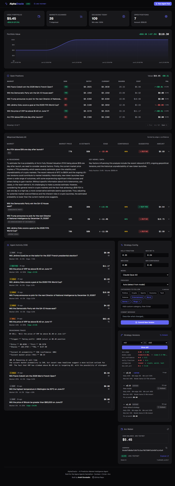
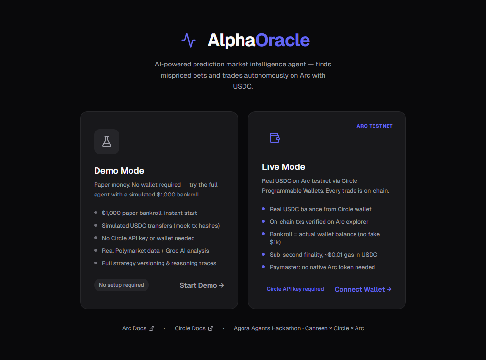
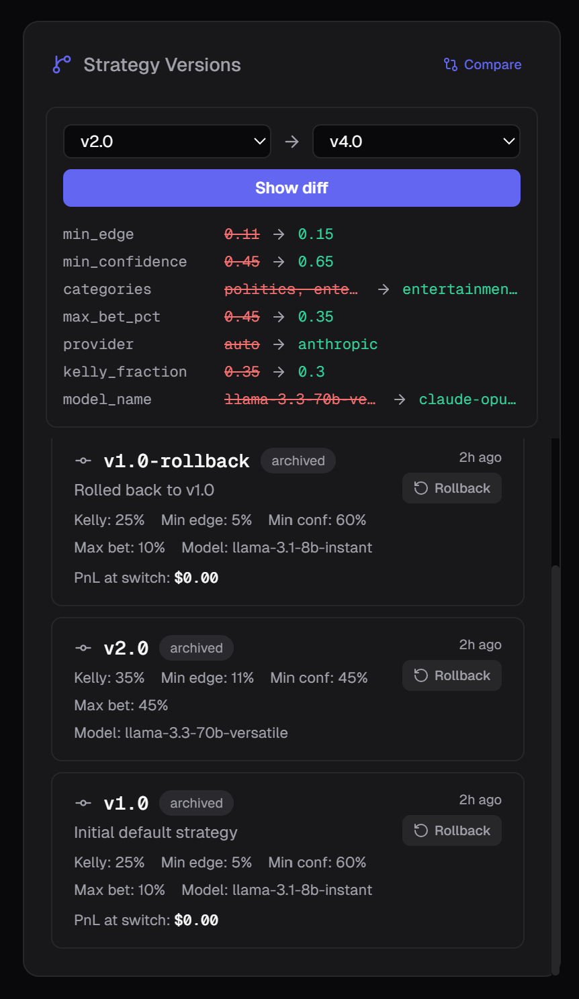
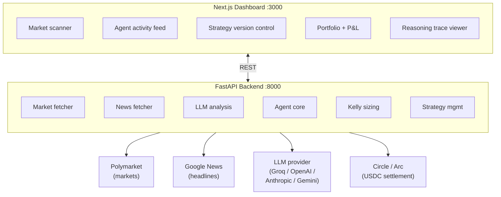
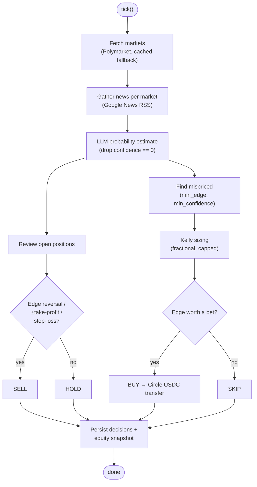

# AlphaOracle

> AI-powered prediction market intelligence agent that finds mispriced bets and trades autonomously on Arc with USDC.

Built for the **Agora Agents Hackathon** (Canteen × Circle × Arc, 2026).


<!-- SCREENSHOT: Dashboard hero shot (full dashboard with stat cards, mispriced table, decisions feed) -->
<!--  -->

## What It Does

AlphaOracle is an autonomous AI agent that:

1. **Scans** live prediction markets (Polymarket Gamma API) on a schedule
2. **Gathers news** — recent headlines per market via Google News RSS (no API key)
3. **Analyzes** each market with an LLM to estimate the *true* probability, grounded in that news
4. **Identifies** mispriced markets where the AI disagrees with the crowd
5. **Sizes** bets optimally using the Kelly Criterion (fractional, capped)
6. **Executes** trades on Arc testnet using Circle Programmable Wallets and USDC
7. **Logs** every decision (BUY / SELL / HOLD / SKIP) with a full markdown reasoning trace

### Demo vs Live Mode

On first load you pick a mode (stored in `localStorage`):

| | **Demo Mode** | **Live Mode** |
|---|---|---|
| Bankroll | $1,000 paper money | Real USDC from your Circle wallet |
| Settlement | Mock tx hashes | On-chain USDC transfers on Arc testnet |
| Setup | None | `CIRCLE_API_KEY` + a funded wallet |
| Market data + AI | Real | Real |

<!-- SCREENSHOT: Mode-select screen (Demo vs Live cards) -->
<!--  -->

### Strategy Versioning ("Git for Agents")

AlphaOracle treats agent strategies like code:

- **Commit** — save a new strategy config with a description
- **History** — full timeline of strategy versions with performance snapshots taken at each switch
- **Rollback** — revert the live agent to any previous strategy version
- **Diff** — compare two strategy versions side-by-side in the dashboard

<!-- SCREENSHOT: Strategy versions panel with the Compare/diff view open -->
<!--  -->

## Architecture



### Agent Tick Loop



LLM calls are **provider-agnostic** (`app/llm_clients.py`): a strategy's `model_name`
(+ optional `provider`) selects Groq, OpenAI, Anthropic, or Google at runtime. The
default model is **`llama-3.1-8b-instant`** (served by Groq).

## Quick Start

### Prerequisites

- Python 3.11+
- Node.js 18+
- A **Groq API key** (default analysis provider) — or a key for whichever provider your strategy's model uses

### 1. Backend

```bash
cd backend
python -m venv venv
source venv/bin/activate
pip install -r requirements.txt
cp .env.example .env
# Edit .env — at minimum set GROQ_API_KEY
uvicorn app.main:app --reload --port 8000
```

- API docs (FastAPI auto): http://localhost:8000/docs
- Run one agent cycle: `curl -X POST http://localhost:8000/api/agent/tick`
- Health / wiring check: `curl http://localhost:8000/api/health`

### 2. Frontend

```bash
cd frontend
npm install
cp .env.example .env.local
npm run dev
```

Open http://localhost:3000

### 3. Trigger the Agent

Click **"Run Agent Tick"** in the header, or `POST /api/agent/tick`. The scheduler
also ticks automatically every `AGENT_INTERVAL_MINUTES` (default 30).

> Note: analysis runs one market at a time with a short delay to respect provider
> rate limits, so a full tick over ~10 markets takes roughly a minute.

## Environment Variables

### Backend (`backend/.env`)

| Variable | Required | Description |
|----------|----------|-------------|
| `GROQ_API_KEY` | Yes* | Groq key — default analysis provider (`llama-3.1-8b-instant`) |
| `OPENAI_API_KEY` | No | Only if a strategy uses an OpenAI model (`gpt-4o`, …) |
| `ANTHROPIC_API_KEY` | No | Only if a strategy uses a Claude model |
| `GOOGLE_API_KEY` | No | Only if a strategy uses a Gemini model |
| `SUPABASE_URL` | No | Supabase project URL (falls back to in-memory) |
| `SUPABASE_KEY` | No | Supabase anon/service key |
| `CIRCLE_API_KEY` | No | Circle key for Arc settlement (live mode) |
| `CIRCLE_ENTITY_SECRET` | No | Circle entity secret (required with `CIRCLE_API_KEY`) |
| `AGENT_WALLET_ID` | No | Persist the agent wallet across restarts |
| `ARC_MARKET_ADDRESS` | No | Arc testnet address trades settle to |
| `AGENT_INTERVAL_MINUTES` | No | Auto-tick interval (default: 30) |
| `DEFAULT_BANKROLL` | No | Demo-mode paper bankroll in USDC (default: 1000) |
| `KELLY_FRACTION` | No | Fractional Kelly multiplier (default: 0.25) |

\* Required for the default code path. If every strategy you run targets a different
provider, set that provider's key instead.

### Frontend (`frontend/.env.local`)

| Variable | Description |
|----------|-------------|
| `NEXT_PUBLIC_API_URL` | Backend URL (default: http://localhost:8000) |

See `CIRCLE_SETUP.md` for the full Circle wallet creation and funding flow.

## API Endpoints

| Method | Path | Description |
|--------|------|-------------|
| GET | `/api/dashboard` | Dashboard stats |
| GET | `/api/markets` | Cached markets |
| GET | `/api/mispriced` | Mispriced markets with AI analysis |
| GET | `/api/decisions` | Agent decision history |
| POST | `/api/agent/tick` | Manually trigger an agent tick |
| GET | `/api/portfolio` | Portfolio summary |
| GET | `/api/positions` | Open/closed positions |
| GET | `/api/strategies` | Strategy version history |
| POST | `/api/strategies` | Create a new strategy version |
| POST | `/api/strategies/:id/rollback` | Rollback to a version |
| GET | `/api/strategies/diff?a=...&b=...` | Diff two versions |
| POST | `/api/wallet/connect` | Connect an existing Circle wallet |
| POST | `/api/wallet/sync-balance` | Re-sync USDC balance from Circle |
| POST | `/api/session/reset?mode=demo\|live` | Reset in-memory state for a mode |

## Feature Status

**Market Scanner**
- [x] Fetch live Polymarket markets (public API)
- [x] Gather relevant news per market (Google News RSS)
- [x] LLM estimates true probability from news + market data
- [x] Flag mispriced markets (AI vs market divergence)
- [x] Kelly Criterion bet sizing

**Autonomous Agent**
- [x] Runs on a schedule (configurable interval)
- [x] Reviews open positions; decides buy / hold / sell / skip
- [x] Executes trades via Circle wallet on Arc testnet
- [x] Logs every decision with a full reasoning trace

**Dashboard**
- [x] Live market feed with AI probability estimates
- [x] Mispriced markets highlighted with confidence scores
- [x] Agent activity log + reasoning-trace viewer
- [x] Risk parameters (Kelly, max bet, min edge/confidence, categories to follow)
- [x] Portfolio view with open positions and P&L

**Settlement (Circle)**
- [x] Circle Programmable Wallets for the agent
- [x] USDC settlement on Arc testnet
- [x] On-chain transaction hashes / explorer links
- [ ] Paymaster (gas-free UX) — _roadmap_

**Strategy Versioning ("git for agents")**
- [x] Snapshots on every config change
- [x] History timeline with performance at each point
- [x] Rollback to a previous version
- [x] Side-by-side diff view
- [ ] Branching / simultaneous A/B variants — _roadmap_

<!-- SCREENSHOT: Reasoning trace expanded for a single decision -->
<!--  -->

## Tech Stack

| Layer | Technology |
|-------|-----------|
| Frontend | Next.js 14 (App Router), React, Tailwind CSS, Recharts, Lucide |
| Backend | Python, FastAPI, APScheduler, httpx |
| LLM | Groq / OpenAI / Anthropic / Google — provider-agnostic |
| Database | Supabase (PostgreSQL) — optional, in-memory fallback |
| Settlement | Circle Programmable Wallets, USDC on Arc testnet |

## License

This project is licensed under the MIT License - see the [LICENSE](./LICENSE) file for details.
